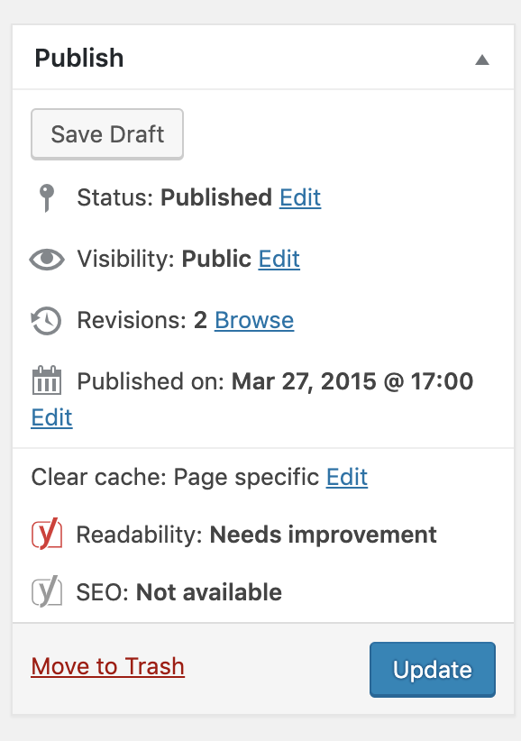

<h1 align="center">
  Wp Draft Published
</h1>

<h4 align="center">
  A plugin for saving draft already published pages. 💡
</h4>
 

    

## Features

- Publish all draft posts and pages on one click..
- Draft published pages.
- Dynamic custom post types - coming soon.

## Contributing

- Fork it!
- Create your feature branch: `git checkout -b my-new-feature`
- Commit your changes: `git commit -am 'Add some feature'`
- Push to the branch: `git push origin my-new-feature`
- Submit a pull request

## License

[MIT](LICENSE)

    

